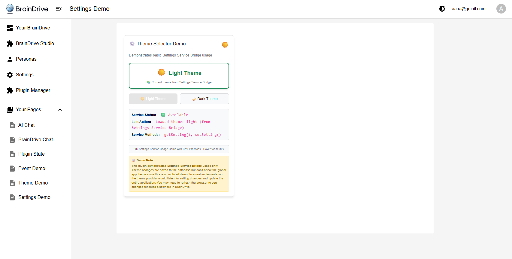

# ServiceExample_Settings - BrainDrive Settings Service Bridge Demo

A working demonstration plugin for BrainDrive's Settings Service Bridge functionality. This plugin showcases persistent configuration management within the BrainDrive platform through an interactive theme selector that demonstrates comprehensive error handling and best practices.



## 🎯 Purpose

This plugin serves as a **working demo** of BrainDrive's Settings Service Bridge, demonstrating:
- How to store and retrieve user settings in BrainDrive
- Persistent configuration management across sessions
- Settings Service Bridge integration patterns
- Production-ready error handling and best practices
- Proper user scope management for settings

## 📦 What's Included

### Theme Selector Demo Module

**Theme Selector** - Interactive theme switcher with comprehensive error handling
- Switch between light and dark themes
- Persistent theme storage using Settings Service Bridge
- Real-time theme application with CSS variables
- Production-ready error handling with retry logic
- Service validation and graceful degradation

### Settings Service Bridge Integration
- Complete Settings Service wrapper implementation
- Proper service bridge connection handling
- User-scoped settings management
- Comprehensive error categorization and handling
- Retry logic with exponential backoff

## 🚀 Installation & Usage

### Prerequisites
- BrainDrive platform (this plugin runs inside BrainDrive)
- Plugin Manager access in BrainDrive

### Installation
1. Install the plugin through BrainDrive's Plugin Manager
2. The plugin will be available in your module library

### Usage in BrainDrive
1. **Create a new page** in BrainDrive
2. **Add the demo module** to your page:
   - Drag "Theme Selector" module to the page
3. **Test the functionality**:
   - Click "Light Theme" or "Dark Theme" buttons
   - Watch the theme change within the plugin component
   - Refresh the page to see settings persistence
   - Monitor error handling and retry behavior

**Important Demo Note:** This plugin demonstrates Settings Service Bridge usage only. Theme changes are saved to the database but don't affect the global app theme since this is an isolated demo. In a real implementation, the theme provider would listen for setting changes and update the entire application.

## 🔧 Demo Features

### Theme Selector Module
- **Theme Switching**: Toggle between light and dark themes
- **Real-time Application**: Immediate visual feedback with CSS variables
- **Persistent Storage**: Settings saved using Settings Service Bridge
- **Error Handling**: Comprehensive error categorization and recovery
- **Service Status**: Visual indicators for service availability
- **Retry Logic**: Automatic retry with exponential backoff for transient failures
- **Graceful Degradation**: Fallback to defaults when services fail
- **Developer Insights**: Real-time status updates and detailed logging

## 📡 Settings Service Bridge Demo

This plugin demonstrates key Settings Service Bridge concepts:

### Service Integration
```typescript
// How the Settings Service Bridge is used
await this.props.services.settings.getSetting('theme_settings', { userId: 'current' });
await this.props.services.settings.setSetting('theme_settings', settingsData, { userId: 'current' });
```

### Settings Management
```typescript
// Get user-scoped settings
const themeSettings = await this.props.services.settings.getSetting(
  'theme_settings', 
  { userId: 'current' }
);

// Save user-scoped settings
await this.props.services.settings.setSetting(
  'theme_settings',
  { theme: 'dark', useSystemTheme: false },
  { userId: 'current' }
);
```

### Error Handling Patterns
```typescript
// Service validation
private async validateServices(): Promise<void> {
  if (!this.props.services?.settings) {
    throw new Error('Settings service is not available');
  }
}

// Retry logic with exponential backoff
private async retryOperation<T>(operation: () => Promise<T>): Promise<T> {
  // Implements 1s, 2s, 4s retry delays
}
```

## 🎓 Learning Objectives

After using this demo, developers will understand:
- How BrainDrive's Settings Service Bridge works
- Patterns for persistent configuration management
- User-scoped settings storage and retrieval
- Production-ready error handling techniques
- Service validation and graceful degradation
- Retry logic implementation with exponential backoff
- Transactional operations with rollback capabilities

## 🧪 Testing the Demo

### Basic Test Flow
1. Place the Theme Selector module on a BrainDrive page
2. Click between "Light Theme" and "Dark Theme" buttons
3. Watch the theme change in real-time
4. Refresh the page to verify settings persistence
5. Monitor the status indicators for service health

### Advanced Testing
- Test with network disconnection to see retry behavior
- Monitor browser console for detailed error handling logs
- Test service unavailability scenarios
- Verify rollback behavior on failed operations
- Check settings persistence across browser sessions

## 🔍 Technical Implementation

### Module Federation Architecture
- Class-based React components for BrainDrive compatibility
- Proper webpack configuration for plugin loading
- Service bridge integration following BrainDrive patterns

### Settings Data Structure
```typescript
interface ThemeSettings {
  theme: 'light' | 'dark';        // Current theme selection
  useSystemTheme: boolean;        // Whether to follow system theme
}
```

### Error Handling Categories
- **Network Errors**: Connection issues, timeouts (retryable)
- **Service Errors**: Service unavailable (retryable)
- **Permission Errors**: Authorization failures (not retryable)
- **Validation Errors**: Invalid data provided (not retryable)
- **Generic Errors**: Unknown errors (potentially retryable)

### Component Lifecycle
- Service validation on component mount
- Proper settings loading with error handling
- Cleanup and error recovery patterns

## 🛠️ For Developers

This plugin serves as a **reference implementation** for:
- Settings Service Bridge integration
- Production-ready error handling patterns
- User-scoped configuration management
- Service validation and graceful degradation
- Retry logic with exponential backoff

### Key Files
- `src/components/ThemeSelector.tsx` - Main demo component with comprehensive error handling
- `src/styles/theme-settings.css` - Theme-aware CSS with CSS variables
- `lifecycle_manager.py` - Plugin lifecycle management
- `README.md` - This comprehensive documentation

## 📋 Requirements

- **BrainDrive Platform**: This plugin must run inside BrainDrive
- **Settings Service**: Requires BrainDrive's Settings Service to be available
- **User Authentication**: Requires authenticated user for user-scoped settings

## 🆘 Troubleshooting

### Common Issues
- **Settings not persisting**: Ensure Settings Service is available in BrainDrive
- **Theme not applying**: Check CSS variable support in browser
- **Service errors**: Verify Settings Service Bridge is properly initialized

### Debug Tips
- Check browser console for Settings Service logs
- Monitor service status indicators in the component
- Use retry count display to track error recovery attempts
- Verify user authentication for user-scoped settings

### Error Messages
The component provides user-friendly error messages:
- "Settings service unavailable - using default theme"
- "Network connection issue. Please check your connection."
- "You do not have permission to access settings."
- "Invalid settings data provided."

## 📚 Related Links

- [BrainDrive](https://github.com/BrainDriveAI/BrainDrive)
- [Service Bridge - Settings Developers Guide](DEVELOPER_GUIDE.md)

---

**Experience BrainDrive's Settings Service Bridge in Action! ⚙️**

*This is a demonstration plugin designed to run within the BrainDrive platform. It showcases persistent configuration management capabilities with production-ready error handling.*